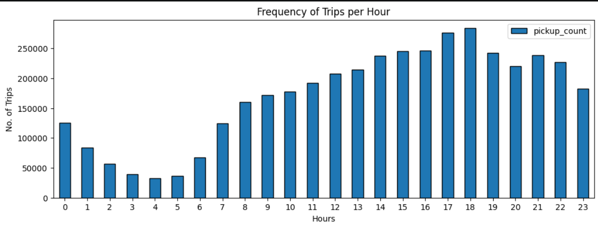
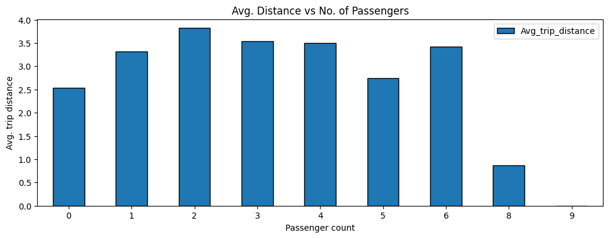
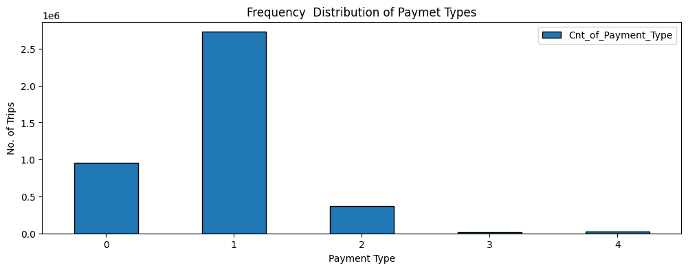
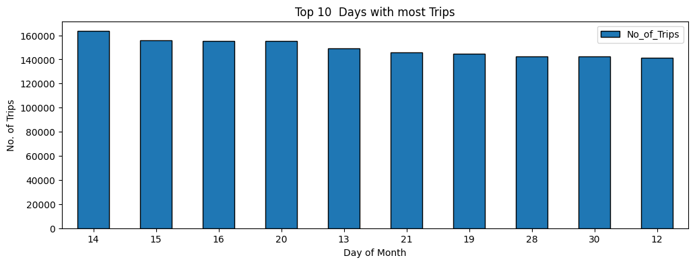
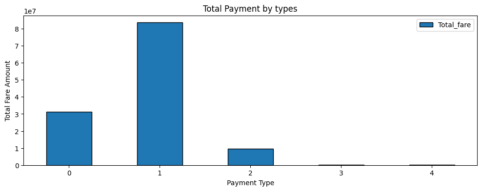
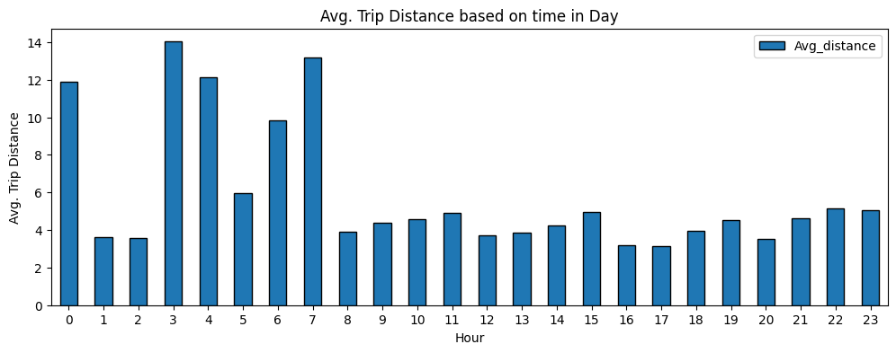
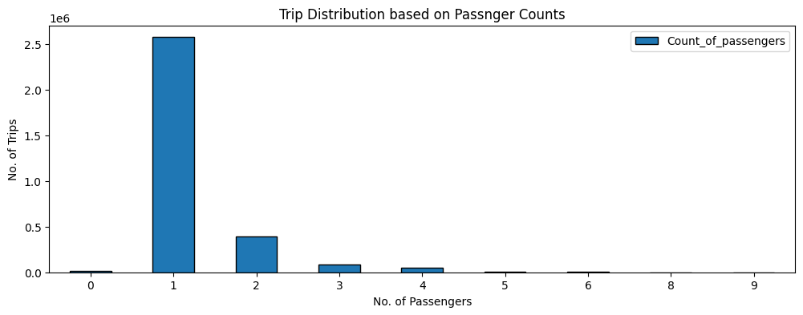
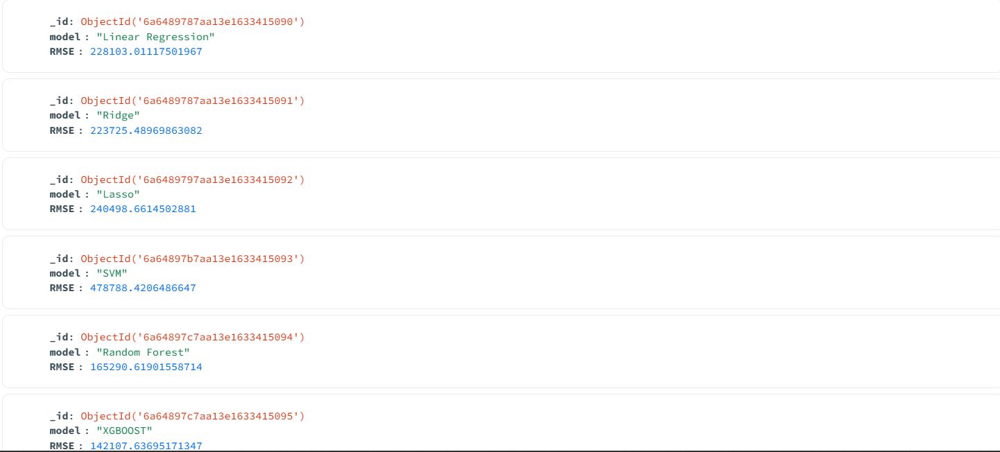

<!-- HEADER -->
<div align="left">

# MongoDB for Data Science

</div>

<div align="center">


</div>

---

## 📖 Project Overview

This repo documents a short MongoDB course and applies it through two data pipelines instead of stopping at shell commands.

The workflow includes:

- MongoDB Fundamentals (CRUD, operators, indexing, aggregation pipeline)
- Connecting to MongoDB from Python with PyMongo
- Loading real datasets into MongoDB collections
- Aggregation-based analysis
- Data visualization
- Machine Learning model development on data read back from MongoDB
- Model evaluation & comparison

The primary objective is to use MongoDB as the working data layer between raw datasets and analysis / ML models, not just as a place to store JSON documents.

---

## 🎯 Objectives

- Learn MongoDB fundamentals: CRUD operations, comparison/logical operators, indexing, aggregation pipeline.
- Connect to MongoDB from Python using PyMongo.
- Load real-world datasets into MongoDB collections.
- Answer analytical questions using the aggregation framework.
- Visualize aggregation results with Matplotlib.
- Build a preprocessing + ML pipeline on data read back out of MongoDB.
- Compare multiple regression models and store results back in MongoDB.

---

## 🛠️ Technologies Used

| Category | Tools |
|-----------|--------|
| Database | MongoDB |
| Driver | PyMongo |
| Programming | Python |
| Data Processing | Pandas, NumPy, PyArrow |
| Visualization | Matplotlib |
| Machine Learning | Scikit-Learn, XGBoost |
| Development | Jupyter Notebook |
| Version Control | Git & GitHub |

---

## 📂 Project Structure

```text
mongodb-for-data-science/
│
├── notes/
│   ├── MongoDB-introduction-notes.pdf
│   └── mongodb-session2-notes.pdf
│
├── project-01-taxi-trip-analysis/
│   ├── dataset/
│   │   └── yellow_tripdata_2026-05.parquet
│   ├── notebook/
│   │   └── taxi_analysis.ipynb
│   └── screenshots/
│      ├── 01_peak_pickup_hours.png
│      ├── 02_avg_distance_by_passenger_count.png
│      ├── 03_payment_type_distribution.png
│      ├── 04_top_10_days_by_trips.png
│      ├── 05_total_fare_by_payment_type.png
│      ├── 06_avg_distance_by_hour.png
│      └── 07_trip_distribution_by_passenger_count.png
│   
│
├── project-02-car-price-prediction/
│   ├── dataset/
│   │   └── car-details.csv
│   ├── notebook/
│   │   └── car_price_prediction.ipynb
│   └── screenshots/
│     └── model_comparison.png
│   
│
├── practice-data/
│   └── office-employees.csv
│
└── README.md
```

---

## 🗄️ MongoDB Setup & Data Pipeline

Both notebooks connect to a local MongoDB instance via PyMongo (`mongodb://localhost:27017/`):

- **Project 1** loads ~4.09M taxi trip records into a `taxis.taxi_data` collection.
- **Project 2** reads car listing data back out of a `cars.car_data` collection and writes each trained model's RMSE into a `cars.model_results` collection.

---

## 📊 Project 1 — NYC Taxi Trip Analysis

One month of NYC Yellow Taxi trip data (4,090,836 records), queried entirely through the MongoDB aggregation pipeline.

### Peak Pickup Hours



Pickups peak at 6 PM (283,663 trips) and 5 PM (276,037), and bottom out around 4 AM (32,504).

---

### Average Trip Distance by Passenger Count



Solo trips average the shortest distance (2.54 mi); 2-passenger trips average the longest among valid groups (3.82 mi).

---

### Payment Type Distribution



Credit card payments make up roughly two-thirds of all trips (2,727,585), well ahead of cash (372,909).

---

### Top 10 Days by Trip Volume



<!-- add the actual top day(s) + trip count here once you paste the corrected output -->

---

### Total Fare by Payment Type



Credit card trips also account for the bulk of fare revenue (~$83.6M) against ~$9.5M for cash.

---

### Average Trip Distance by Hour



Trip distances spike overnight — 3 AM rides average 14.0 mi, versus 3–5 mi during regular daytime hours.

---

### Trip Distribution by Passenger Count



Solo riders dominate at ~63% of all trips with a recorded passenger count; 2-passenger trips are a distant second at ~9.7%.

---

## 🤖 Project 2 — Car Price Prediction

6,926 used-car listings, read back out of MongoDB and run through a preprocessing + regression pipeline.

### Preprocessing

| Step | Detail |
|------|--------|
| Dropped columns | `_id`, `name`, `edition` |
| Numeric pipeline | Median imputation → StandardScaler |
| Categorical pipeline | Most-frequent imputation → OneHotEncoder |
| Split | 80/20 train-test (5,540 / 1,386 rows) |

### Models Trained

- Linear Regression
- Ridge
- Lasso
- SVM (SVR)
- Random Forest
- XGBoost

### Model Performance Comparison



| Model | RMSE |
|-------|------|
| XGBoost | **142,107.64** |
| Random Forest | 165,290.62 |
| Ridge | 223,725.49 |
| Linear Regression | 228,103.01 |
| Lasso | 240,498.66 |
| SVM (SVR) | 478,788.42 |

Each model's RMSE was written back into the `cars.model_results` collection in MongoDB as it was evaluated.

---

## 🔍 Key Insights

- Evening rush (5–6 PM) drives the highest taxi pickup volume; the early-morning window (3–5 AM) is the quietest.
- Overnight trips cover noticeably more distance on average than daytime trips — consistent with longer, less traffic-constrained routes.
- Credit card is the dominant payment method by both trip count and fare revenue, by a wide margin over cash.
- For car price prediction, tree-based models (XGBoost, Random Forest) clearly outperformed linear models and SVR — XGBoost cut RMSE by ~38% versus plain Linear Regression.
- SVR performed worst by a large margin, likely because the features weren't scaled specifically for it beyond the shared numeric pipeline.

---

## 🚀 Future Improvements


- Tune hyperparameters for Random Forest / XGBoost instead of using fixed `n_estimators`/`max_depth`.
- Scale features specifically for SVR rather than reusing the shared preprocessing pipeline.
- Deploy the car price model behind a simple Streamlit or Flask interface.

---

## About the Author

**Rushit Tholiya**  
[LinkedIn Profile](https://www.linkedin.com/in/rushit-tholiya-605341311/)

[GitHub Profile](https://github.com/Rushit004)