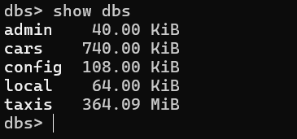
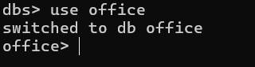
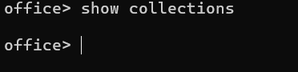
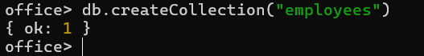
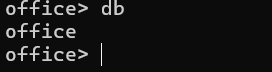
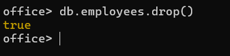
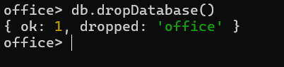

# 🍃 01 — Basic Commands

Setup notes: throughout this whole `commands/` folder, I'm using database **`office`** and collection **`employees`**, populated from `office-employees.csv`.

---

### 1. Show all databases
```js
show dbs
```


---

### 2. Create / switch to the `office` database
```js
use office
```


---

### 3. Show all collections in the current database
```js
show collections
```


---

### 4. Create the `employees` collection
```js
db.createCollection("employees")
```


---

### 5. Show the current working database
```js
db
```


---

### 6. Clear the terminal screen
```js
cls
```


---

### 7. Drop the `employees` collection 
```js
db.employees.drop()
```


---

### 8. Drop the `office` database 
```js
db.dropDatabase()
```


---

### 9. Close the shell
```js
exit
```
