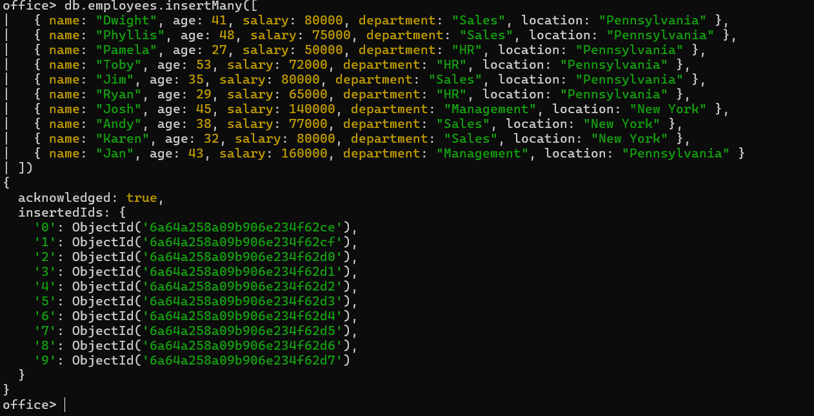

# 🍃 02 — Insertion Operations

Data used: `office-employees.csv` → 12 employees total. I'm inserting **Michael** with `insertOne`, then the remaining **11 employees** with `insertMany`.

---

### 1. `insertOne` — add a single document
```js
db.employees.insertOne({
  name: "Michael",
  age: 47,
  salary: 125000,
  department: "Management",
  location: "Pennsylvania"
})
```


---

### 2. `insertMany` — add the rest of the employees at once
```js
db.employees.insertMany([
  { name: "Dwight", age: 41, salary: 80000, department: "Sales", location: "Pennsylvania" },
  { name: "Phyllis", age: 48, salary: 75000, department: "Sales", location: "Pennsylvania" },
  { name: "Pamela", age: 27, salary: 50000, department: "HR", location: "Pennsylvania" },
  { name: "Toby", age: 53, salary: 72000, department: "HR", location: "Pennsylvania" },
  { name: "Jim", age: 35, salary: 80000, department: "Sales", location: "Pennsylvania" },
  { name: "Ryan", age: 29, salary: 65000, department: "HR", location: "Pennsylvania" },
  { name: "Josh", age: 45, salary: 140000, department: "Management", location: "New York" },
  { name: "Andy", age: 38, salary: 77000, department: "Sales", location: "New York" },
  { name: "Karen", age: 32, salary: 80000, department: "Sales", location: "New York" },
  { name: "Jan", age: 43, salary: 160000, department: "Management", location: "Pennsylvania" }
])
```

