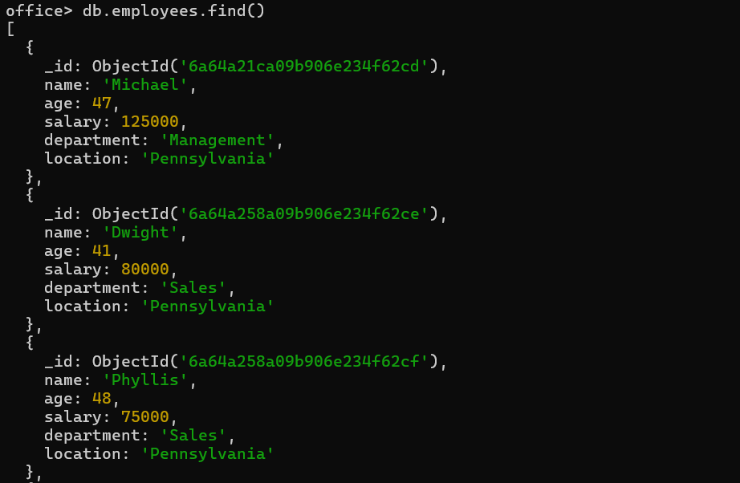
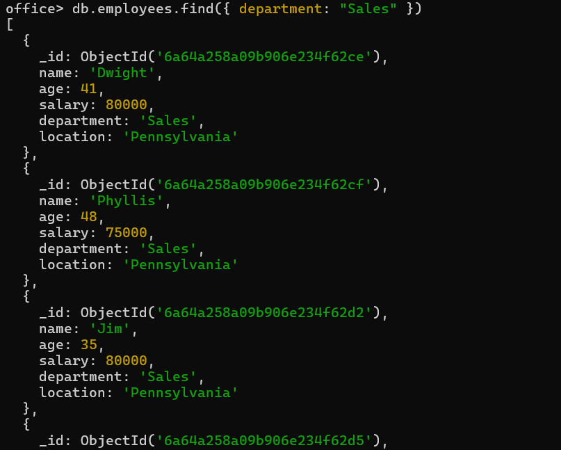
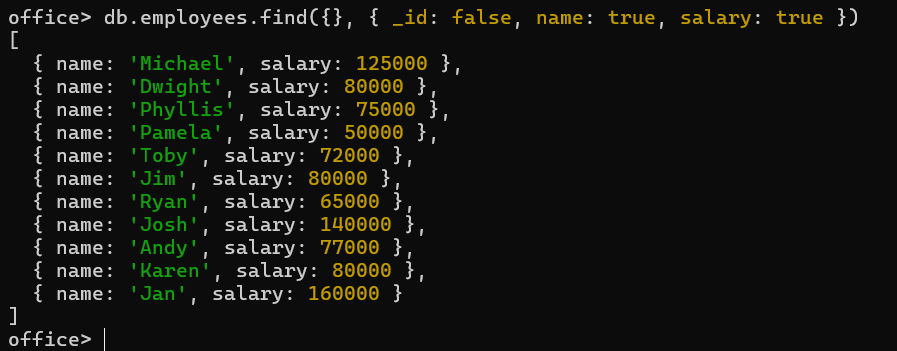
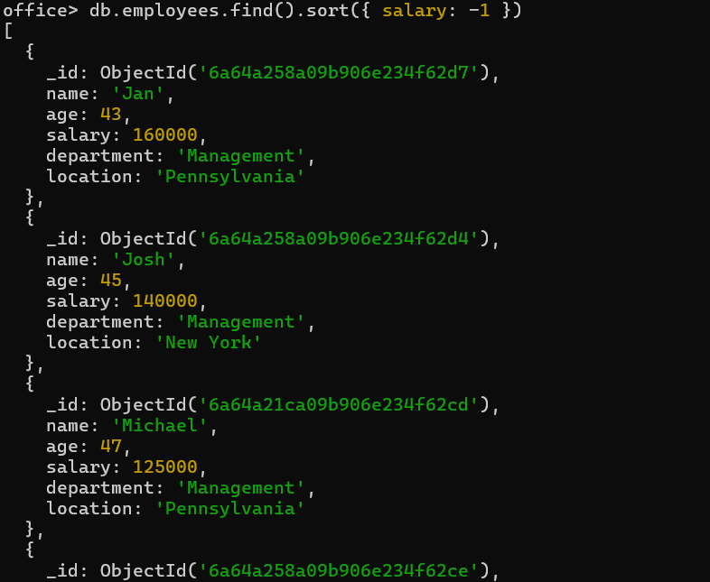
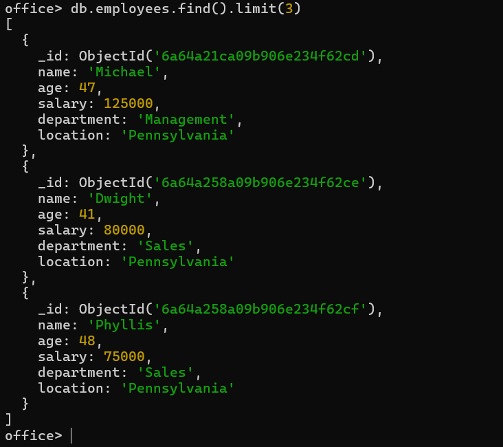

# 🍃 03 — Querying Data

`find` is the main method used to query documents: `db.<collection>.find({query}, {projection})`

---

### 1. Display all documents in the collection
```js
db.employees.find()
```


---

### 2. Display documents matching a specific value (query parameter)
```js
db.employees.find({ department: "Sales" })
```


---

### 3. Display only specific fields (projection parameter)
```js
db.employees.find({}, { _id: false, name: true, salary: true })
```


---

### 4. Sort documents (1 = ascending, -1 = descending)
```js
db.employees.find().sort({ salary: -1 })
```


---

### 5. Limit the number of results returned
```js
db.employees.find().limit(3)
```
