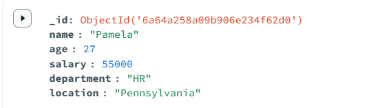
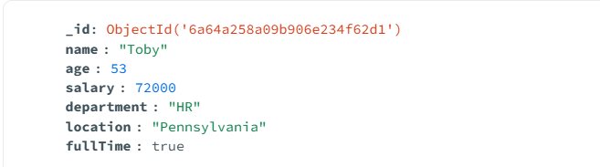
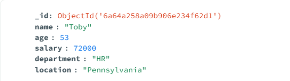
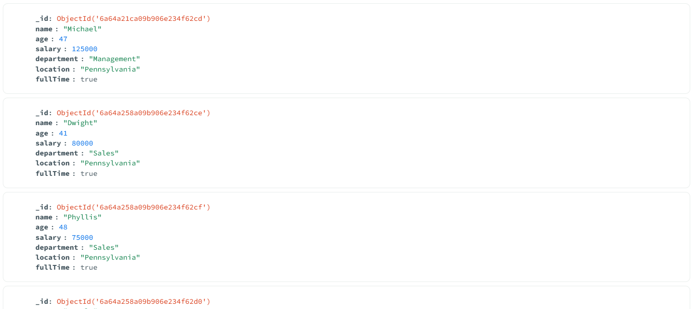
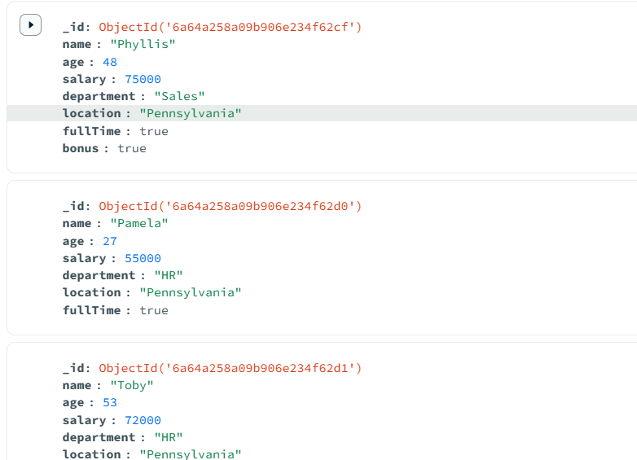

# 🍃 04 — Updating Data

`updateOne` / `updateMany` both take two parameters: `{filter}` and `{update}`.

---

### 1. Change the value of an existing field (`$set`)
```js
db.employees.updateOne(
  { name: "Pamela" },
  { $set: { salary: 55000 } }
)
```


---

### 2. Create a new field on a document (`$set`)
```js
db.employees.updateOne(
  { name: "Toby" },
  { $set: { fullTime: true } }
)
```


---

### 3. Remove a field from a document (`$unset`)
```js
db.employees.updateOne(
  { name: "Toby" },
  { $unset: { fullTime: "" } }
)
```


---

### 4. Add a field to every document (`updateMany`, empty filter)
```js
db.employees.updateMany(
  {},
  { $set: { fullTime: true } }
)
```


---

### 5. Update all documents that match a filter condition
```js
db.employees.updateMany(
  { department: "Sales" },
  { $set: { bonus: true } }
)
```
