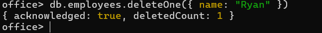
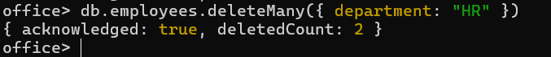

# 🍃 05 — Deleting Data


### 1. `deleteOne` — remove a single document matching a filter
```js
db.employees.deleteOne({ name: "Ryan" })
```


---

### 2. `deleteMany` — remove all documents matching a filter
```js
db.employees.deleteMany({ department: "HR" })
```
