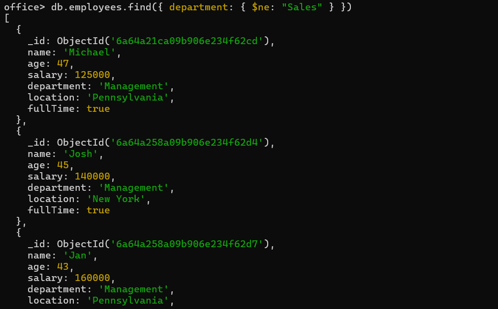
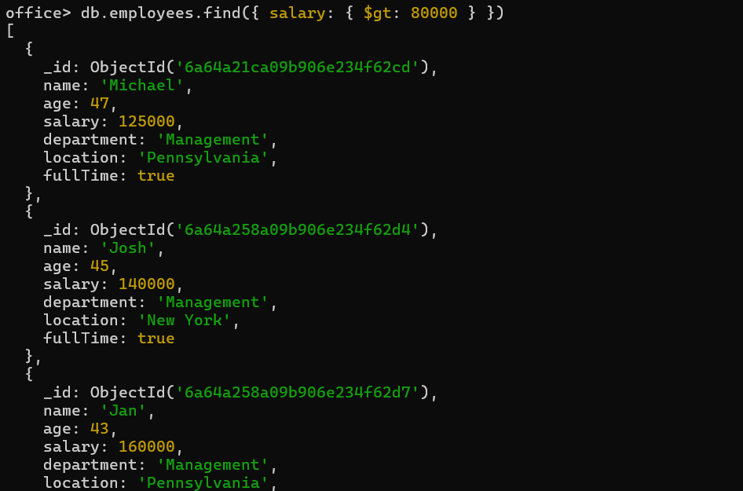
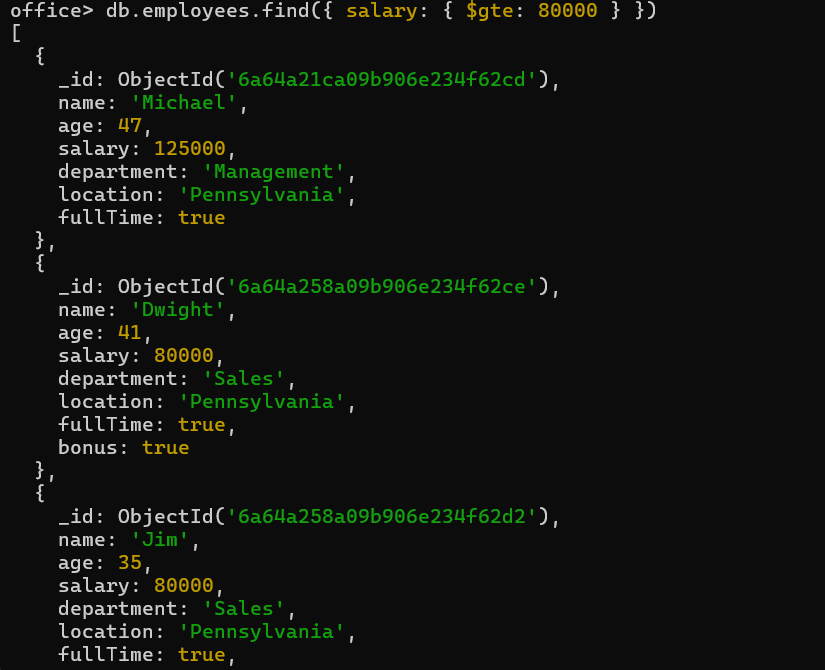
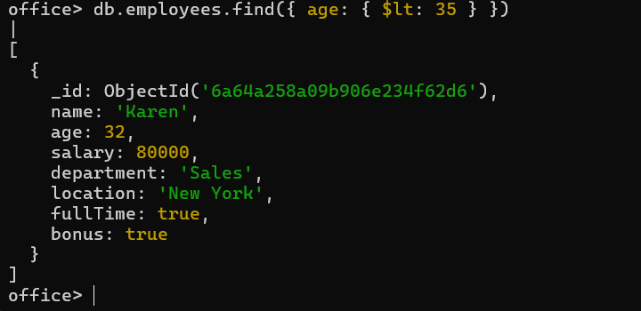
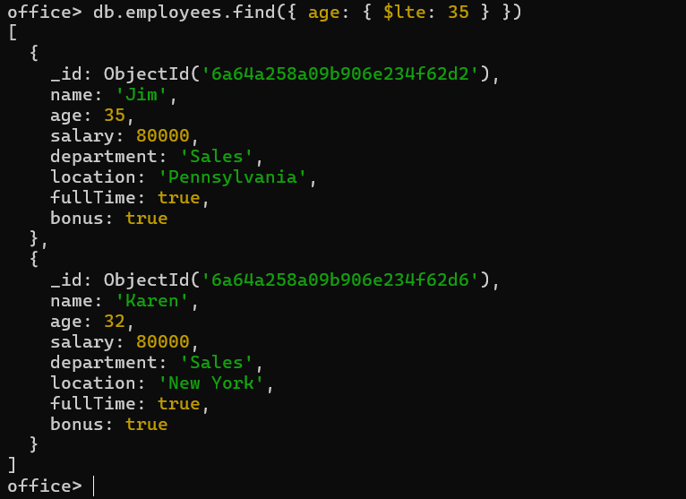
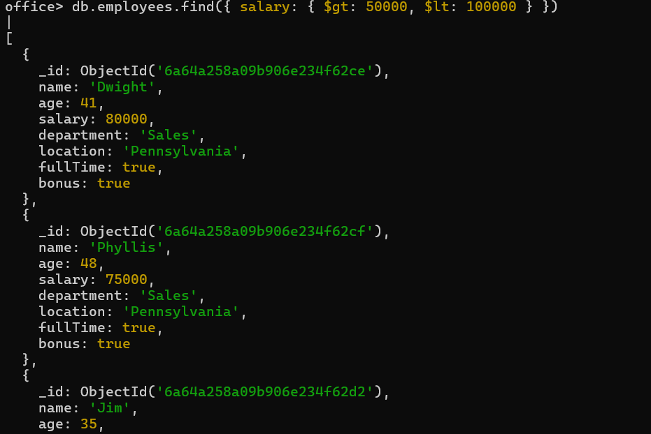
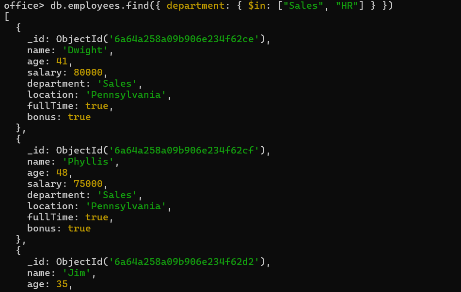
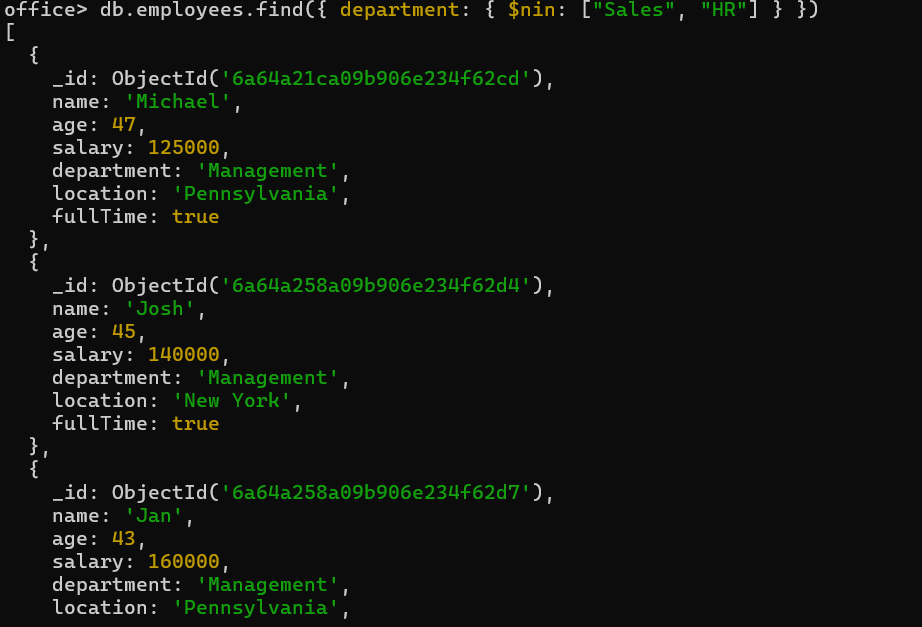

# 🍃 06 — Comparison Operators

| Operation | Operator |
|---|---|
| Not Equal To | `$ne` |
| Greater Than | `$gt` |
| Greater Than Equal To | `$gte` |
| Lesser Than | `$lt` |
| Lesser Than Equal To | `$lte` |
| Any one of given values | `$in` |
| None of given values | `$nin` |

---

### 1. `$ne` — department is not Sales
```js
db.employees.find({ department: { $ne: "Sales" } })
```


---

### 2. `$gt` — salary greater than 80000
```js
db.employees.find({ salary: { $gt: 80000 } })
```


---

### 3. `$gte` — salary greater than or equal to 80000
```js
db.employees.find({ salary: { $gte: 80000 } })
```


---

### 4. `$lt` — age less than 35
```js
db.employees.find({ age: { $lt: 35 } })
```


---

### 5. `$lte` — age less than or equal to 35
```js
db.employees.find({ age: { $lte: 35 } })
```


---

### 6. Numeric range — combine `$gt`/`$lt` on the same field
```js
db.employees.find({ salary: { $gt: 50000, $lt: 100000 } })
```


---

### 7. `$in` — department is Sales or HR
```js
db.employees.find({ department: { $in: ["Sales", "HR"] } })
```


---

### 8. `$nin` — department is neither Sales nor HR
```js
db.employees.find({ department: { $nin: ["Sales", "HR"] } })
```
