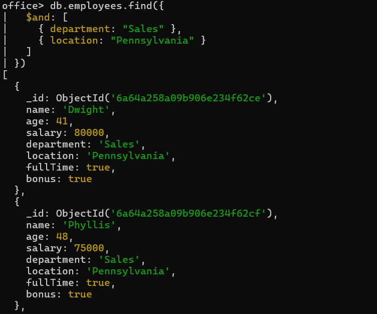
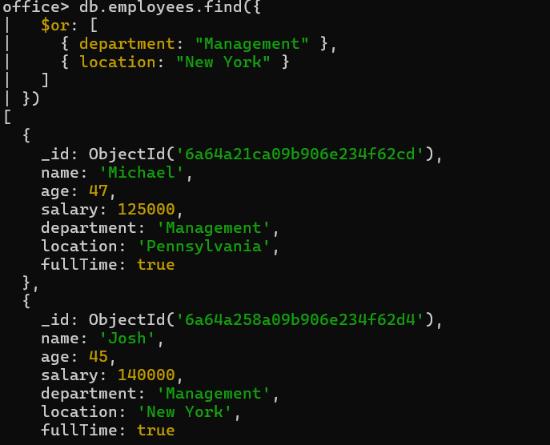
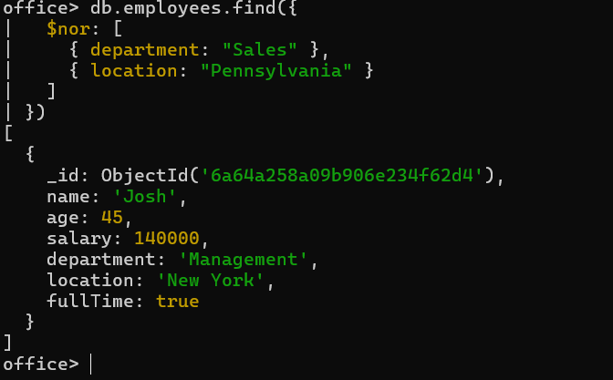
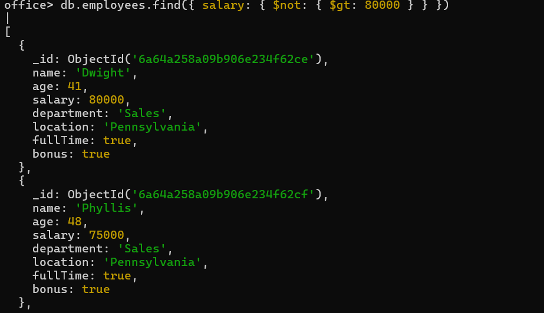

# 🍃 07 — Logical Operators

MongoDB provides `$and`, `$or`, `$nor`, and `$not`. `$and`/`$or`/`$nor` take their conditions inside an array `[]`; `$not` simply wraps a comparison operator.

---

### 1. `$and` — Sales department AND Pennsylvania location
```js
db.employees.find({
  $and: [
    { department: "Sales" },
    { location: "Pennsylvania" }
  ]
})
```


---

### 2. `$or` — Management department OR New York location
```js
db.employees.find({
  $or: [
    { department: "Management" },
    { location: "New York" }
  ]
})
```


---

### 3. `$nor` — neither Sales department NOR Pennsylvania location
```js
db.employees.find({
  $nor: [
    { department: "Sales" },
    { location: "Pennsylvania" }
  ]
})
```


---

### 4. `$not` — salary NOT greater than 80000
```js
db.employees.find({ salary: { $not: { $gt: 80000 } } })
```
