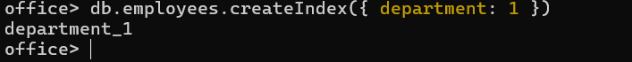
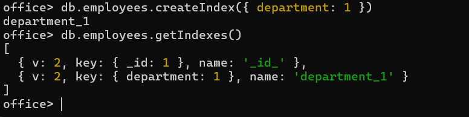
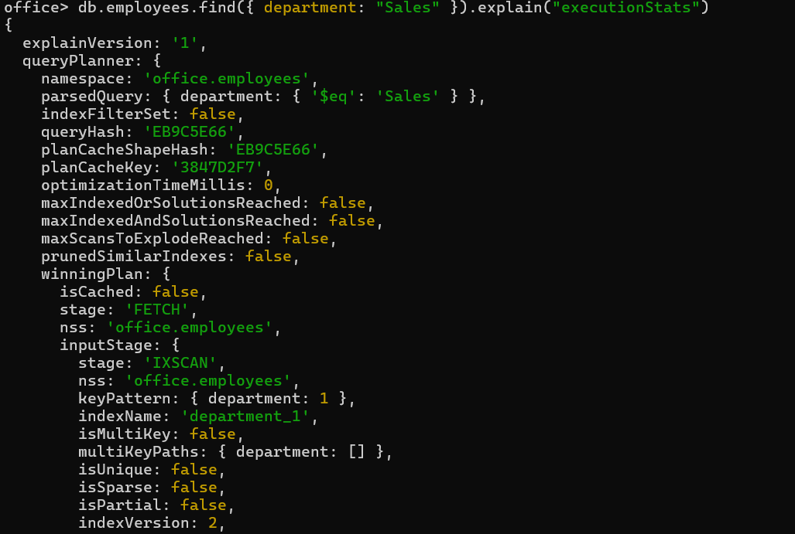
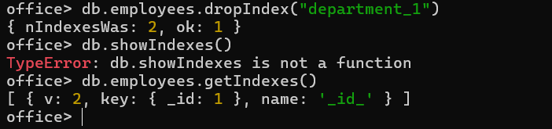

# 🍃 08 — Indexing

Indexes let MongoDB avoid scanning every document to satisfy a query. Stored as B-Trees; `_id` is indexed by default.

---

### 1. Create an index (ascending, on `department`)
```js
db.employees.createIndex({ department: 1 })
```


---

### 2. View all indexes on the collection
```js
db.employees.getIndexes()
```


---

### 3. Analyze query performance with `explain`
```js
db.employees.find({ department: "Sales" }).explain("executionStats")
```


---

### 4. Delete an index
```js
db.employees.dropIndex("department_1")
```
