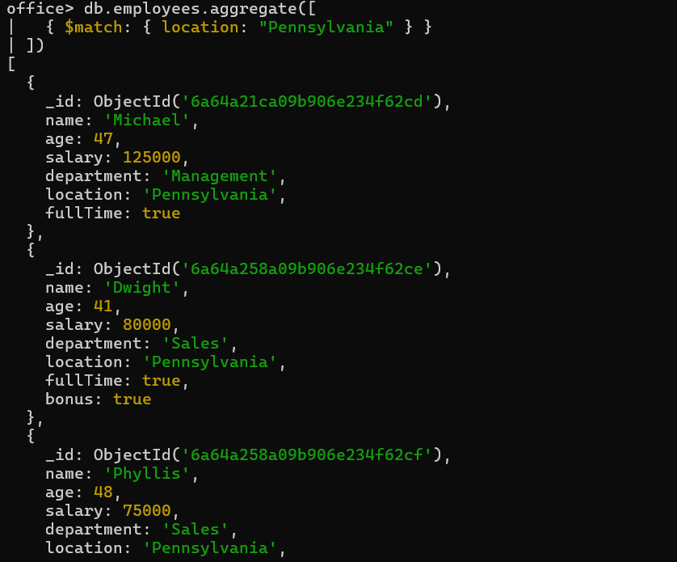
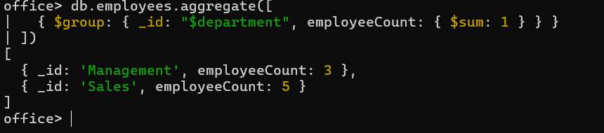
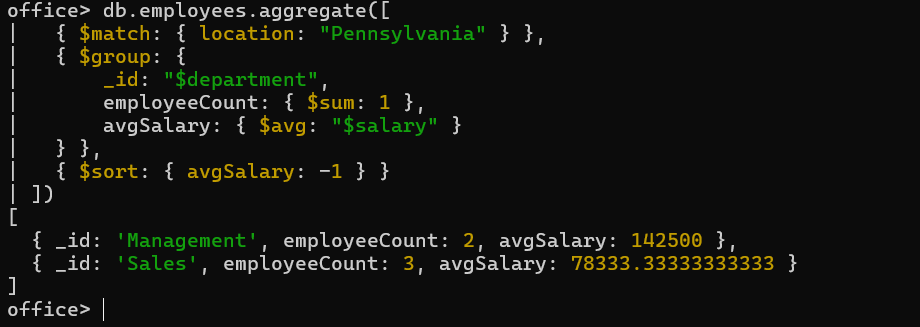

# 🍃 09 — Aggregation Pipeline

Aggregation processes documents through sequential **stages** (`input → $match → $group → $sort → output`) to return computed results.

| Stage | Description |
|---|---|
| `$match` | Filters documents |
| `$group` | Groups documents by a key and performs aggregations |
| `$sort` | Sorts documents |

Math operators used below: `$sum`, `$avg`.

---

### 1. `$match` — filter employees to only Pennsylvania
```js
db.employees.aggregate([
  { $match: { location: "Pennsylvania" } }
])
```


---

### 2. `$group` — count employees per department
```js
db.employees.aggregate([
  { $group: { _id: "$department", employeeCount: { $sum: 1 } } }
])
```


---

### 3. Full pipeline (from the PDF's practice question):
**"Identify the department in Pennsylvania with the highest average salary, and the number of employees in each department."**
```js
db.employees.aggregate([
  { $match: { location: "Pennsylvania" } },
  { $group: {
      _id: "$department",
      employeeCount: { $sum: 1 },
      avgSalary: { $avg: "$salary" }
  } },
  { $sort: { avgSalary: -1 } }
])
```
